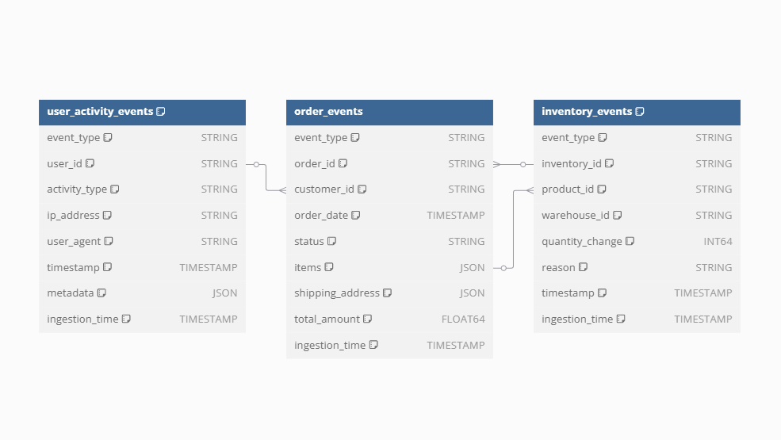

# Real-time Data Pipeline with Dataflow and BigQuery

## Overview
This repository contains the implementation of a real-time data pipeline using **Google Cloud Dataflow (Apache Beam)**, **Pub/Sub**, and **BigQuery**. The pipeline ingests events from a Pub/Sub topic, processes and transforms them, and writes the structured data into BigQuery and Google Cloud Storage (GCS) for further analysis.

## Architecture
The pipeline is designed to handle three types of events:
1. **Order Events** - Tracks customer orders and their statuses.
2. **Inventory Events** - Monitors changes in inventory levels.
3. **User Activity Events** - Captures user interactions within the system.

### Components
- **Pub/Sub**: Acts as the event source, receiving all events in a single topic (`backend-events-topic`).
- **Dataflow (Apache Beam)**: Processes messages from Pub/Sub and routes them to the appropriate destinations.
- **BigQuery**: Stores structured event data for analytics and reporting.
- **GCS**: Stores raw event data for archival and potential reprocessing.

## BigQuery Schema Design
The data model consists of three partitioned and clustered tables:

## Tables Schema 

### Visualization



### DBML to reproduce this visualization in dbdiagram.io

```sql
Table user_activity_events {
  event_type STRING [note: "Type of event, e.g. user_activity"]
  user_id STRING [note: "Unique identifier for the user (UUID)"]
  activity_type STRING [note: "Type of activity: login, logout, view_product, etc."]
  ip_address STRING [note: "IP address from where the activity originated"]
  user_agent STRING [note: "User agent string representing device/browser info"]
  timestamp TIMESTAMP [note: "Datetime of the user activity event"]
  metadata JSON [note: "Additional info about the user session, platform, etc."]
  ingestion_time TIMESTAMP [note: "Timestamp when the event was ingested into BigQuery"]
  
  Note: "Stores user activity events for tracking engagement data"
}

Table order_events {
  event_type STRING [note: "Type of event received (e.g., 'order')"]
  order_id STRING [note: "Unique identifier for the order"]
  customer_id STRING [note: "Unique identifier for the customer who placed the order"]
  order_date TIMESTAMP [note: "Timestamp when the order was placed"]
  status STRING [note: "Current status of the order (e.g., 'pending', 'shipped', 'delivered')"]
  items JSON [note: "List of items in the order, including product ID, name, quantity, and price"]
  shipping_address JSON [note: "Shipping address for the order"]
  total_amount FLOAT64 [note: "Total value of the order"]
  ingestion_time TIMESTAMP [note: "Timestamp when the event was ingested into the data pipeline"]
}

Table inventory_events {
  event_type STRING [note: "Type of event, e.g. inventory"]
  inventory_id STRING [note: "Unique identifier for the inventory event (UUID)"]
  product_id STRING [note: "Unique identifier for the product (UUID)"]
  warehouse_id STRING [note: "Unique identifier for the warehouse (UUID)"]
  quantity_change INT64 [note: "Change in quantity (-100 to 100)"]
  reason STRING [note: "Reason for the change: restock, sale, return, damage"]
  timestamp TIMESTAMP [note: "Datetime when the inventory change occurred"]
  ingestion_time TIMESTAMP [note: "Timestamp when the event was ingested into BigQuery"]
  
  Note: "Stores inventory-related events for tracking stock levels"
}

Ref: order_events.customer_id > user_activity_events.user_id
Ref: order_events.order_id > inventory_events.inventory_id
Ref: inventory_events.product_id > order_events.items

```

## DDLs for creating the Bigquery tables

### Order Events Table (`backend_events_data.order_events`)
```sql
CREATE OR REPLACE TABLE `re-case.backend_events_data.order_events` (
  event_type STRING OPTIONS(description="Type of event received (e.g., 'order')"),
  order_id STRING OPTIONS(description="Unique identifier for the order"),
  customer_id STRING OPTIONS(description="Unique identifier for the customer who placed the order"),
  order_date TIMESTAMP OPTIONS(description="Timestamp when the order was placed"),
  status STRING OPTIONS(description="Current status of the order (e.g., 'pending', 'shipped', 'delivered')"),
  items ARRAY<STRUCT<
    product_id STRING OPTIONS(description="Unique identifier for the product"),
    product_name STRING OPTIONS(description="Name of the product"),
    quantity INT64 OPTIONS(description="Number of units of the product in the order"),
    price FLOAT64 OPTIONS(description="Unit price of the product at the time of purchase")
  >> OPTIONS(description="List of items in the order, including product ID, name, quantity, and price"),
  shipping_address STRUCT<
    street STRING OPTIONS(description="Street address for delivery"),
    city STRING OPTIONS(description="City for delivery"),
    country STRING OPTIONS(description="Country for delivery")
  > OPTIONS(description="Shipping address for the order"),
  total_amount FLOAT64 OPTIONS(description="Total value of the order"),
  ingestion_time TIMESTAMP OPTIONS(description="Timestamp when the event was ingested into the data pipeline")
)
PARTITION BY DATE(order_date)
CLUSTER BY status, customer_id;
```
- **Partitioning by `order_date`**: Allows efficient time-based queries on order history.
- **Clustering by `status, customer_id`**: Optimizes queries filtering by order status or customer ID.

### Inventory Events Table (`backend_events_data.inventory_events`)
```sql
CREATE OR REPLACE TABLE `re-case.backend_events_data.inventory_events` (
  event_type STRING OPTIONS (description="Type of event, e.g. inventory"),
  inventory_id STRING OPTIONS (description="Unique identifier for the inventory event (UUID)"),
  product_id STRING OPTIONS (description="Unique identifier for the product (UUID)"),
  warehouse_id STRING OPTIONS (description="Unique identifier for the warehouse (UUID)"),
  quantity_change INT64 OPTIONS (description="Change in quantity (-100 to 100)"),
  reason STRING OPTIONS (description="Reason for the change: restock, sale, return, damage"),
  timestamp TIMESTAMP OPTIONS (description="Datetime when the inventory change occurred"),
  ingestion_time TIMESTAMP OPTIONS (description="Timestamp when the event was ingested into BigQuery")
)
PARTITION BY DATE(timestamp)
CLUSTER BY product_id, warehouse_id
OPTIONS(
  description="Stores inventory-related events for tracking stock levels"
);

```
- **Partitioning by `timestamp`**: Enables querying inventory changes over time efficiently.
- **Clustering by `product_id, warehouse_id`**: Helps optimize searches on stock movements per product and warehouse.

### User Activity Events Table (`backend_events_data.user_activity_events`)
```sql
CREATE OR REPLACE TABLE `re-case.backend_events_data.user_activity_events` (
  event_type STRING OPTIONS (description="Type of event, e.g. user_activity"),
  user_id STRING OPTIONS (description="Unique identifier for the user (UUID)"),
  activity_type STRING OPTIONS (description="Type of activity: login, logout, view_product, etc."),
  ip_address STRING OPTIONS (description="IP address from where the activity originated"),
  user_agent STRING OPTIONS (description="User agent string representing device/browser info"),
  timestamp TIMESTAMP OPTIONS (description="Datetime of the user activity event"),
  metadata STRUCT<
    session_id STRING,
    platform STRING
  > OPTIONS (description="Additional info about the user session, platform, etc."),
  ingestion_time TIMESTAMP OPTIONS (description="Timestamp when the event was ingested into BigQuery")
)
PARTITION BY DATE(timestamp)
CLUSTER BY user_id, activity_type
OPTIONS(
  description="Stores user activity events for tracking engagement data"
);

```
- **Partitioning by `timestamp`**: Facilitates querying user interactions over time.
- **Clustering by `user_id, activity_type`**: Improves search performance when analyzing specific users and activity types.

### Data Schema and Storage Design
Each event type is stored in a separate BigQuery table with optimized partitioning and clustering strategies:

- **Partitioning**:
  - `order_events` is partitioned by `DATE(order_date)` since most queries filter data by order date.
  - `inventory_events` is partitioned by `DATE(timestamp)` to optimize searches for inventory changes over time.
  - `user_activity_events` is partitioned by `DATE(timestamp)` to track user behavior trends efficiently.

- **Clustering**:
  - `order_events` is clustered by `status` and `customer_id`, as queries frequently filter by order status and customer.
  - `inventory_events` is clustered by `product_id` and `warehouse_id`, enabling quick lookups for product stock levels.
  - `user_activity_events` is clustered by `user_id` and `activity_type`, allowing efficient filtering based on user interactions.

These strategies improve query performance and cost efficiency by reducing the amount of scanned data.

## Time Travel and Historical Data Retrieval
BigQuery provides built-in **Time Travel** capabilities, allowing queries on historical snapshots of a table up to **seven days in the past**. This enables:
- Recovery of mistakenly deleted or updated data.
- Comparison of data changes over time.
- Debugging and auditing of data pipelines.

To use Time Travel in BigQuery, you can query past data using the `FOR SYSTEM_TIME AS OF` clause:

```sql
SELECT * FROM `re-case.backend_events_data.order_events`
FOR SYSTEM_TIME AS OF TIMESTAMP_SUB(CURRENT_TIMESTAMP(), INTERVAL 3 DAY)
```

Alternatively, historical data can be retrieved from **Google Cloud Storage (GCS)**, where events are stored in a structured folder hierarchy. This provides long-term retention beyond BigQuery's 7-day limit.

## Monitoring and Error Handling
Effective monitoring is crucial for maintaining the pipeline's reliability and cost efficiency.

### Error Monitoring
- **Dataflow Job Monitoring**: Track worker usage and performance metrics.
- **BigQuery Error Logs**: Stores rejected records for later analysis.

### Cost Monitoring
- **Dataflow Job Monitoring**: Also track costs and can bi accessed via console.
- **BigQuery Cost Analysis**: Monitor scanned bytes and optimize queries accordingly.

All monitoring tools are available in the **Google Cloud Console**, ensuring visibility into the pipeline's health and cost-effectiveness.

## Streaming Pipeline Implementation
The Apache Beam pipeline consists of the following steps:
1. **Read Messages from Pub/Sub**: The pipeline reads raw event messages from the `backend-events-topic` subscription.
2. **Parse and Validate JSON**: Ensures that messages are well-formed and match expected schemas.
3. **Route Events by Type**: Messages are filtered and directed to the appropriate tables.
4. **Write to BigQuery**: Events are inserted into their respective partitioned and clustered tables.
5. **Write to GCS**: Raw events are archived in a structured folder format.

### GCS Storage Structure
The events are stored in GCS using a structured directory pattern:
```
output/
  ├── order/
  │   └── YYYY/
  │       └── MM/
  │           └── DD/
  │               └── HH/
  │                   └── order_YYYYMMDDHHMMSS.json
  ├── inventory/
  ├── user_activity/
```
This structure enables easy retrieval of historical data by event type and timestamp.

## Deployment Instructions
To deploy the pipeline to **Google Cloud Dataflow**, use the following command:
```bash
python main.py \
   --input_subscription projects/re-case/subscriptions/backend-events-topic-sub \
   --bq_dataset backend_events_data \
   --bq_project re-case \
   --runner DataflowRunner \
   --project re-case \
   --region us-central1 \
   --job_name backend-events-pipeline \
   --temp_location gs://backend_events_data/temp \
   --staging_location gs://backend_events_data/staging \
   --streaming \
   --gcs_output_path gs://backend_events_data/output
```

## Conclusion
This pipeline efficiently processes streaming events, storing structured data in BigQuery for analytics while maintaining a raw event archive in GCS. The design leverages partitioning and clustering to enhance query performance and scalability.

